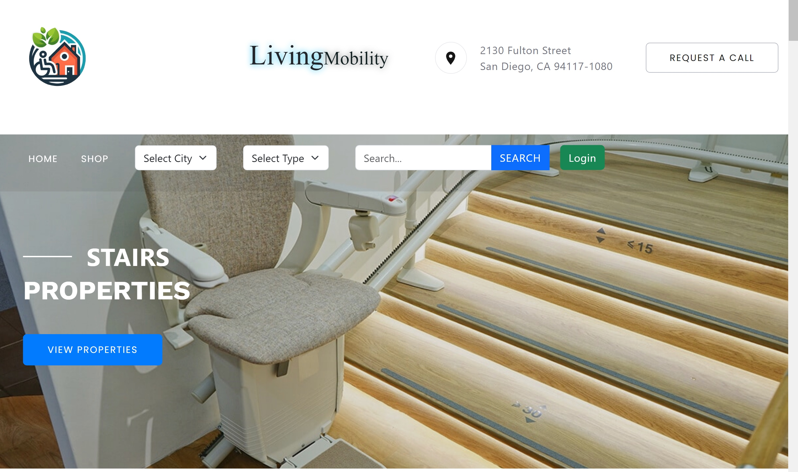
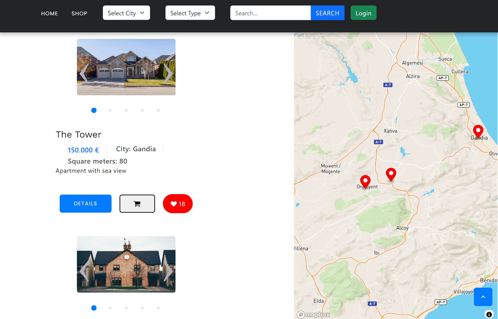
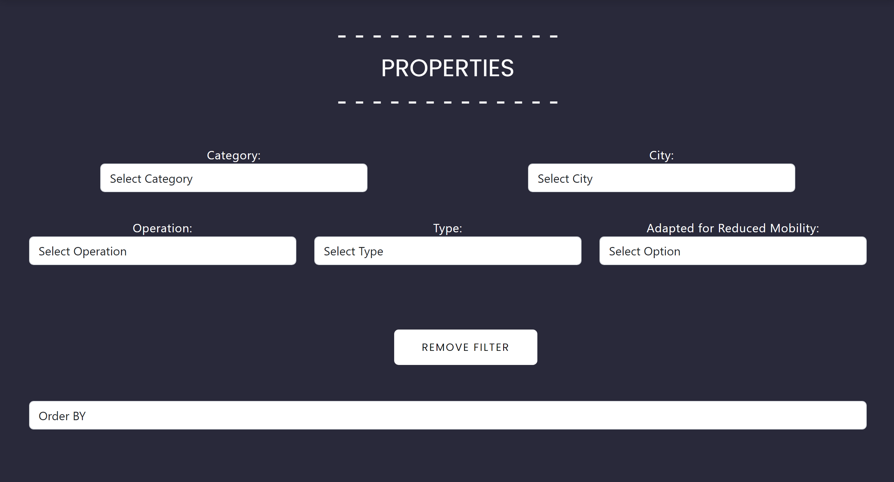
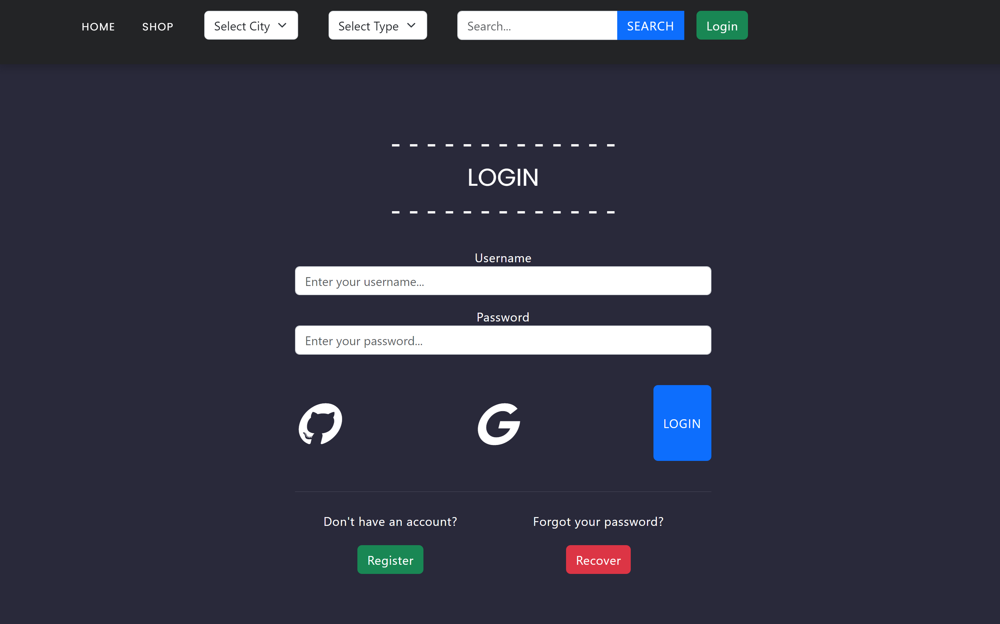
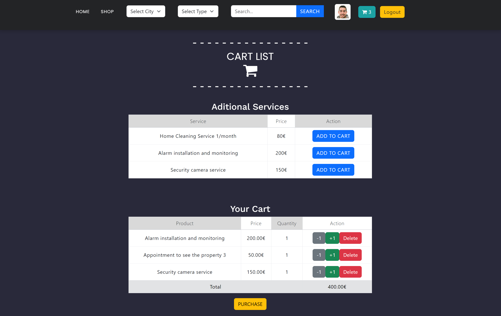
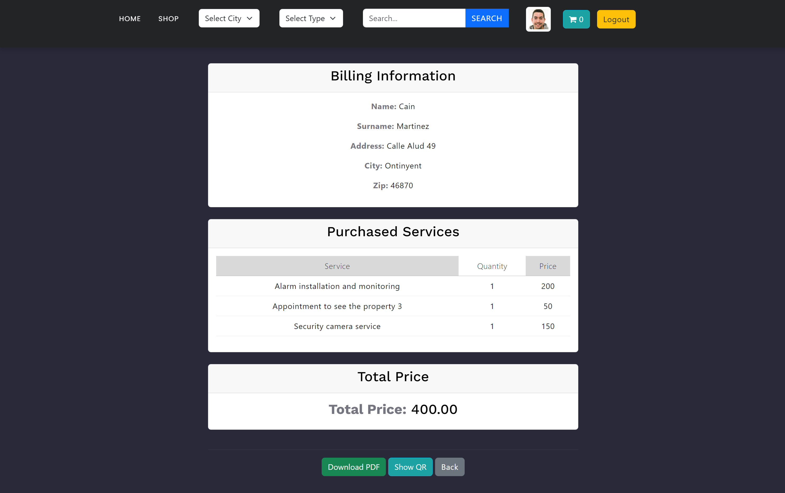
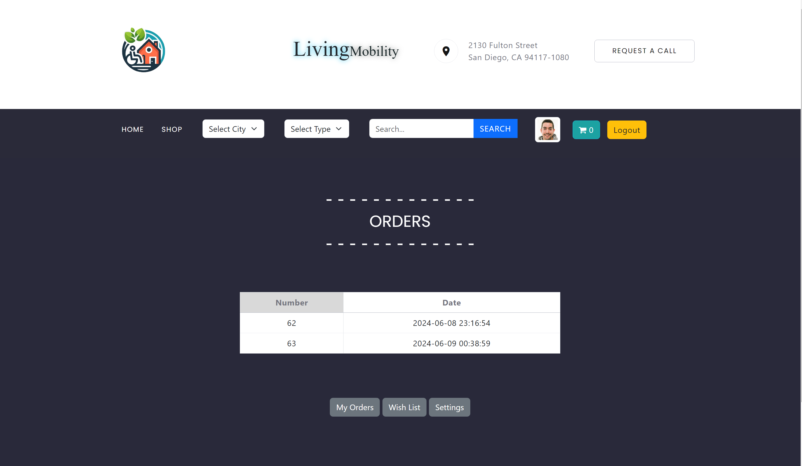

Aquí tienes el README con las imágenes añadidas debajo de cada título correspondiente:

---

# Living Mobility

## Descripción

Living Mobility es un marketplace dedicado a la venta de inmuebles adaptados para personas con movilidad reducida. 
Ofrece una experiencia de usuario intuitiva y funcionalidades avanzadas para facilitar la búsqueda y compra de viviendas accesibles.

## Tecnologías

|  |  |  |  |  | 
|:---:|:---:|:---:|:---:|:---:|
|  |   |  |  |  | 

## Funcionalidades Generales

### Home 🏨

La sección de Home es donde los usuarios tienen su primer contacto con la plataforma:

- Search para búsqueda dinámica.
- Carrusel dinámico.
- Filtros predefinidos.
- Recomendaciones, más visitados y últimas visitas.

### Shop 📃

El Shop es el componente más crucial de la aplicación, donde los usuarios pueden filtrar, ordenar la búsqueda, acceder a los detalles del producto y agregarlos al carrito, entre otras funciones:

- Listar los inmuebles.
- Ordenarlos por preferencia del usuario.
- Aplicación de varios filtros simultáneos.
- Mapa con la localización exacta de las viviendas con una pequeña descripción e imagen.
- Todas las secciones excepto el details tienen paginación.
- Scroll que va listando inmuebles recomendados dentro del details.
- Añadir tu favorita a la lista mediante likes.

### Auth 🚪

Esta sección es la más segura de la aplicación y permite a los usuarios registrarse o iniciar sesión:

- Creación y validación de usuarios nuevos.
- Los datos se validan tanto en el cliente como en el servidor.
- Social login con acceso desde github, google y linkedin.
- Se permite recuperar la contraseña mediante email y cambiarla.

### Cart 🛒

Esta sección permite a los usuarios ver los productos que han agregado a su carrito de compras:

- Los usuarios pueden agregar citas para las viviendas a su carrito.
- Desde el carrito se pueden añadir servicios, sumarle y restarle cantidades o simplemente eliminarl cualquier producto de la cesta.
- Al pulsar en comprar se mostrará un formulario con los datos de facturación y método de pago.
- Al finalizar el pago se mostrará una vista previa de la factura.

### Profile 👤

Esta sección permite a los usuarios ver y editar su perfil, consultar sus facturas o ver la lista de viviendas deseadas:

- Los usuarios pueden ver su información de perfil, incluyendo username, correo electrónico y foto de perfil.
- Se puede editar la contraseña e imagen de perfil.
- O ver el historial de compras y facturas detalladas.
- Posibilidad de descargarse las facturas en pdf o escanearlas mediante un código QR.
- En la sección Wish List se muestran las viviendas que previamente se le ha dado like, con posibilidad de entrar a los detalles o eliminarlas de esa lista.

### Properties 🏡 (Próximamente)

Esta sección permite a los usuarios crear, ver y gestionar las propiedades:

- Los usuarios pueden crear propiedades desde el botón en menú superior, con posibilidad de subir hasta 5 imágenes.
- Pueden ver una lista de todas sus propiedades subidas.
- Desde esa vista tienen la posibilidad de borrarlas o entrar a editarlas.
- Si alguien compra una cita para una vivienda pasará al estado de reservada automáticamente pero el usuario podrá quitar ese estado.

### Extras

- Depuración en PHP mediante error_log redireccionado a un archivo debug.log ubicado en la raiz del proyecto.

---
